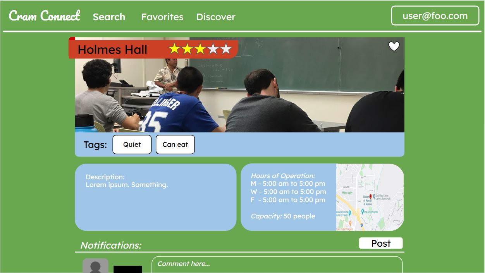

## Table of Contents
* [Description](#description)
* [Goals](#goals)
* [User Guide](#user-guide)
* [Development Team](#development-team)

## Description
*The problem:* Students typically limit themselves to only studying consistent locations when there are hundreds of available study spots all over campus. Sinclair or Hamilton library are the “go-to” study spots, but both can get busy throughout the week and especially during finals week. There are many spots available to students that are not utilized because students are not aware of it.

*The solution:* A website that will allow students to post and rate study spots throughout the UH Manoa campus and the surrounding areas so that other students become aware of possible study spots. The entry for each location will list hours, capabilities, capacity of the location, and accessibility to different types of students. In addition, there is a “real-time” feature, where students can login and provide time-stamped notifications about the current state of the study space. This can inform other students about whether the space is noisy, or crowded, or even quiet and empty.

## Cram Connect Goal
To provide a intuitive user interface that can provide an efficient system to allow students to discover and rate study spots in and around the UH Manoa campus.

The system should eventually provide a sign-in system that allows the user to edit their preferences, filter out study spaces to find an appealing location, and receive real time notifications about the current state of study spaces. After the initial development of our website, we hope to add additional features to Cram Connect, including maps information about study spaces and a news feed of the latest updates on users' favorite locations.

## User Guide
User guide, currently a mockup, provides a breakdown of the Cram Connect website and its proposed page structures.

### Landing page
The landing page is the top-level URL for the Cram Connect website.

### Sign in
The user can login in to manage their account and interact with the Cram Connect community.

### Register
The user can create a new account by filling in the appropriate fields.

### Example Study Location
The user can take a look at each study location and add notifications.

### Search
The search page will allow each user to filter study spots to find the best study environment.

### Favorites
User can view the status of their selected favorite locations.

### User Profile
The user can edit their profile with their information and preferences.

## Meet the Development Team
* [Marionne Casipit](https://marionne.github.io/)

   
   
Marionne Casipit is an undergraduate at the University of Hawaii at Manoa pursuing a

   
Bachelor's in Computer Engineering, expected to graduate in the Spring of 2020.

* [Willy Chang](https://willychangx.github.io/)

* [Alysha Fujitani](https://alyshafujitani.github.io/)

* [Matthew Sahara](https://saharama.github.io/)

