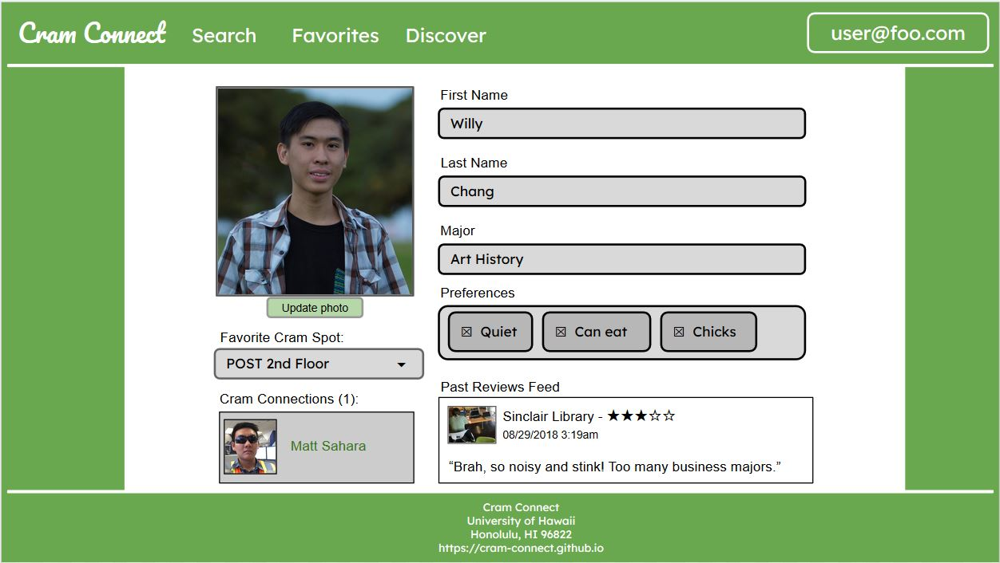

## Table of Contents
* [Description](#description)
* [User Guide](#user-guide)

## Description
*The problem:* Students typically limit themselves to only studying consistent locations when there are hundreds of available study spots all over campus. Sinclair or Hamilton library are the “go-to” study spots, but both can get busy throughout the week and especially during finals week. There are many spots available to students that are not utilized because students are not aware of it.

*The solution:* A website that will allow students to post and rate study spots throughout the UH Manoa campus and the surrounding areas so that other students become aware of possible study spots. The entry for each location will list hours, capabilities, capacity of the location, and accessibility to different types of students. In addition, there is a “real-time” feature, where students can login and provide time-stamped notifications about the current state of the study space. This can inform other students about whether the space is noisy, or crowded, or even quiet and empty.

## User Guide
User guide provides a break down of Cram Connect website and its proposed page structures.

### Landing page
The landing page is the top-level URL for the Cram Connect website.

### Sign in
The user can login in to manage their account and interact with the Cram Connect community.

### User Profile
The User can edit their profile with their information and preferences.

