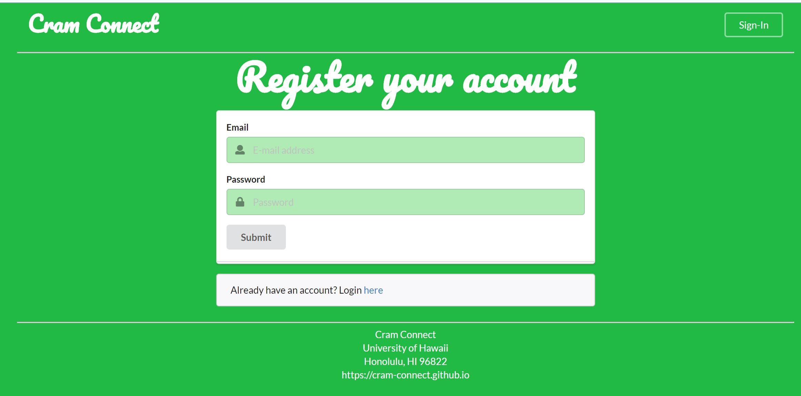

<title>Cram Connect</title>

## Table of Contents
* [Overview](#overview)
* [Goals](#goals)
* [Galaxy Deployment](#galaxy-deployment)
* [GitHub Organization](#github-organization)
* [Milestones](#milestones)
* [User Guide](#user-guide)
* [Developer Guide](#developer-guide)
* [Development Team](#meet-the-development-team)

## Overview 
Cram connect a website that will allow students to post and rate study spots throughout the UH Manoa campus and the surrounding areas so that other students become aware of possible study spots. The entry for each location will list hours, capabilities, capacity of the location, and accessibility to different types of students. In addition, there is a “real-time” feature, where students can login and provide time-stamped notifications about the current state of the study space. This can inform other students about whether the space is noisy, or crowded, or even quiet and empty.

## Goals
To provide a intuitive user interface that can provide an efficient system to allow students to discover and rate study spots in and around the UH Manoa campus.

The system should eventually provide a sign-in system that allows the user to edit their preferences, filter out study spaces to find an appealing location, and receive real time notifications about the current state of study spaces. After the initial development of our website, we hope to add additional features to Cram Connect, including maps information about study spaces and a news feed of the latest updates on users' favorite locations.

## Galaxy Deployment
Cram Connect is deployed using Galaxy and be accessed through this [link](http://cram-connect.meteorapp.com/#/), or by pasting the following in the web browser:
```
http://cram-connect.meteorapp.com/#/
```

## GitHub Organization
The GitHub organization for Cram Connect can be accessed [here](https://github.com/cram-connect), or by pasting the following in the web browser:
```
https://github.com/cram-connect
```

## Milestones
* [M1 Project: Milestone 1](https://github.com/cram-connect/cram-connect/projects/2)
* [M2 Project: Milestone 2](https://github.com/cram-connect/cram-connect/projects/1)
* [M3 Project: Milestone 3](https://github.com/cram-connect/cram-connect/projects/3)

### Milestone 1
The Cram Connect system has been deployed to Galaxy. We currently have a landing page, as shown below. 


### Milestone 2
The Cram Connect system has been deployed to Galaxy. We now have a sign in page, register page, a profile page, a location page, and an add location page as shown below. 





### Milestone 3
The Cram Connect system was not deployed to Galaxy due to the expiration of the free trial. We have implemented a search page, a favorites page, and a discover page. The add location page has been updated with new inputs. The locations page has been updated with a map feature.  


## User Guide
Our user guide, currently containing page mockups, provides a breakdown of the Cram Connect website and its proposed page structures.

### Landing page
The landing page is the top-level URL for the Cram Connect website.


### Sign in
The user can login in to manage their account and interact with the Cram Connect community.


### Register
The user can create a new account by filling in the appropriate fields.


### Example Study Location
The user can take a look at each study location and add notifications.


### Search
The search page will allow each user to filter study spots to find the best study environment.


### Favorites
User can view the status of their selected favorite locations.


### User Profile
The user can edit their profile with their information and preferences.


## Developer Guide 
Our developer guide, will guide the developer into downloading, installing, running, and modifying the system. 

First step is to download and [install meteor](https://www.meteor.com/install).

Second, go to [https://github.com/cram-connect/cram-connect](https://github.com/cram-connect/cram-connect) and download a copy Cram Connect. 

Third, cd into the app/ directory of your local copy of the repo, and install third party libraries with:
```
$ meteor npm install
```
Fourth, once all the libraries are installed the application can be run with: 
```
$ meteor npm run start
```
If the system runs with no errors, the application will be available at  [http://localhost:3000]( http://localhost:3000)

### ESLint
You can verify that the code obeys our coding standards by running ESLint over the code in the imports/ directory with:
```
$ meteor npm run lint
```

## Meet the Development Team
* [Marionne Casipit](https://marionne.github.io/)

<p align="center">
   <br>
   Marionne Casipit is an undergraduate at the University of Hawaii at Manoa pursuing a Bachelor's in Computer Engineering, expected to graduate in the Spring of 2020.
</p>

* [Willy Chang](https://willychangx.github.io/)

<p align="center">
   <br>
   Willy Chang is an undergraduate at the University of Hawaii at Manoa pursuing a Bachelor's in Computer Engineering, expected to graduate in the Spring of 2021.
</p>


* [Alysha Fujitani](https://alyshafujitani.github.io/)

<p align="center">
   <br>
   Alysha Fujitani is an undergraduate at the University of Hawaii at Manoa pursuing a Bachelor's in Computer Engineering, expected to graduate in the Spring of 2020.
</p>

* [Matthew Sahara](https://saharama.github.io/)

<p align="center">
   <br>
   Matthew Sahara is an undergraduate at the University of Hawaii at Manoa pursuing a Bachelor's in Electrical Engineering with a focus on Electro-Physics, expected to graduate in the Fall of 2020.
</p>
